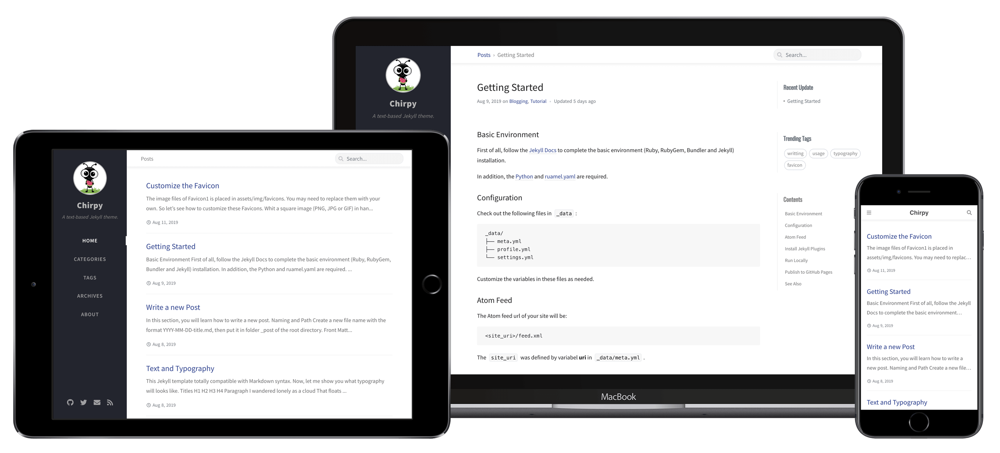

# Jekyll Theme Chirpy

[](https://travis-ci.org/cotes2020/jekyll-theme-chirpy)
[](https://github.com/cotes2020/jekyll-theme-chirpy/releases)
[](https://github.com/cotes2020/jekyll-theme-chirpy/blob/master/LICENSE)
[](https://996.icu)

A Jekyll theme with responsive web design that focuses on text presentation. [Live Demo »](https://chirpy.cotes.info)



## Features

* Last modified date
* Table of Contents
* Disqus Comments
* Syntax highlighting
* Two Level Categories
* Search
* Support dual language (en-US & zh-CN)
* HTML compress
* Atom feeds
* Google Analytics
* Pageviews (Advanced)

## Quick start

First of all, complete the installation of the following environment dependencies:

- [Ruby](https://www.ruby-lang.org/en/downloads/)
- [RubyGem](https://rubygems.org/pages/download)
- [Bundler](https://bundler.io/)
- [Jekyll](https://jekyllrb.com/)
- [Python](https://www.python.org/downloads/) 
- [ruamel.yaml](https://pypi.org/project/ruamel.yaml/)

Clone the repository to local and go to the root directory of it.

Install the Jekyll plugins:

```
$ bundle install
```

Boot your site locally:

```
$ bash run.sh
```

Now, open your favorite brower and visit [http://127.0.0.1:4000](http://127.0.0.1:4000)

Refer to the [documentation](https://chirpy.cotes.info/posts/getting-started/) for details. Hope you like it.

## Used by

* [Cotes' Blog](https://blog.cotes.info)

## License

This work is published under MIT License.
